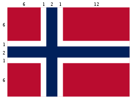
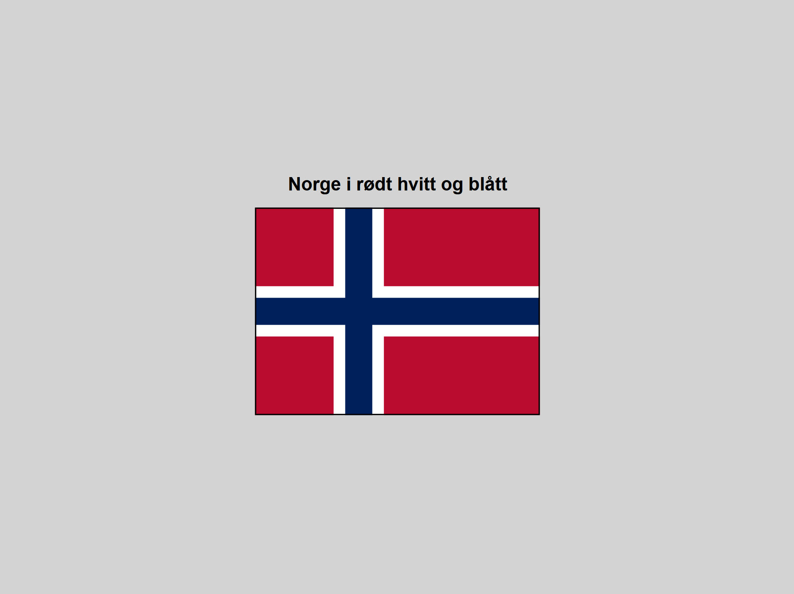

# Det norske flagget

[Source code](https://github.com/chriskodehub/KH-7_det-norske-flagget)  
[Live demo](https://chriskodehub.github.io/KH-7_det-norske-flagget/)

Bildet ovenfor viser det norske flagget i riktige proporsjoner. I denne oppgaven skal vi tegne vårt vakre flagg ved å burke rect-elmentet og -taggen.

Med taggen tegner vi en usynlig rektangulær ramme. Vi kan tegne mange ulike figurer i en svg-ramme. Blant annet kan vi tegne rektangel, ellipse, linke osv. og gi dem ulike stiler inne i .
 
Koden nedenfor tegner det norske flagget i riktige proporsjoner og farger, men den er ikke ferdig. [Bruk denne koden her](https://jsfiddle.net/AUD_SUPER_ME/te3nahwj/2/)

a) Utforsk koden og se hvordan figuren endrer seg, legg til nye rect-elementer slik at den tegner hele det norske flagget.

b) Vi kan legge tekste på en figur tegnet i tagg, og gi den ønsket stil. Gå til https://www.w3schools.com/graphics/svg_text.asp og finn ut mer om svg text-element.

c) Skriv teksten "Ja vi elsker dette landet" på venstre topp-hjørne på det norske flagget og gi den ca tretti graders rotasjon, slik at teksten vises over flagget. Velg farge på teksten din.

Lykke til!

## Result

